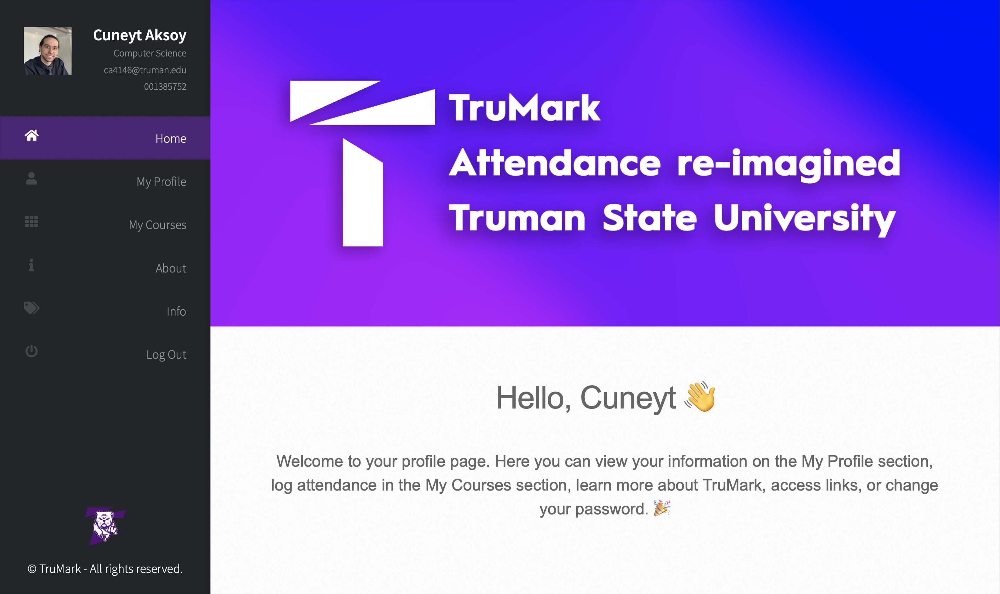

# TruMark 🚀
## 🚀🖊 | Attendance Tracking Using Machine Learning Verification 

*TruMark main page screenshot*

> Leveraging machine learning algorithms and signature analysis for user verification, TruMark aims to enhance and modernize attendance tracking on campus. 

>Students can seamlessly log their attendance for courses through an intuitive interface. By automating parts of the attendance tracking process, TruMark provides convenience and helps ensure data integrity. The system is designed wholly with the Truman end-user experience in mind, from its user- friendly platform to its ability to monitor course attendance.

>Drawing inspiration from existing University platforms like TruView and BrightSpace, TruMark looks to fill a void in a practical everyday need in the academic setting. By streamlining the attendance tracking process, TruMark seeks to enrich the academic experience at Truman State University, serving as a stepping stone on the path toward a more intuitive, technology-driven environment.

In this Repo, you will find the following:

- Full Report explaining all the components in detail, including the machine learning model, the database, and the web application.

- The web application code, which is written in Python.

- The machine learning model code, which is written in Python.

- The database code, which is written in SQL.

- The presentation slides.

